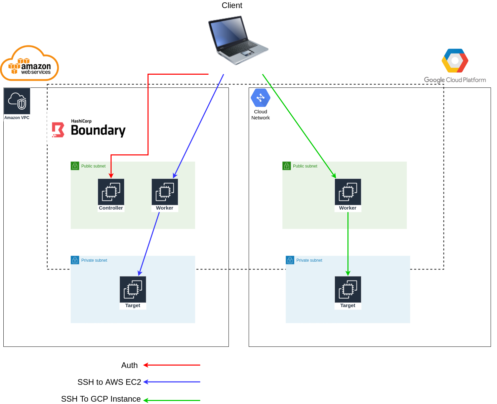

# SOURCE

This repository is based on:

<https://github.com/hashicorp/boundary-reference-architecture>

With GCP resources added and several modifications to AWS infrastructure.

It is recommended to check READMEs in that repository first, although it is not necessary.

**Please note this is a development and testing scenario and it is not production-ready as every secret is in plain text, no redundancy is configured etc.**

## Requirements

- Terraform 0.13.5
- Boundary 0.1.1 Git Revision 6e5aff3d5b083ed57a5e02abecdde202f982d112 (This is the version we have used, there are new versions available now)
- Pass 1.7.1 (Other versions may work and it is not a constraint if not using keyring-type=pass for auth against boundary)

## Deploy

First, the infrastructure must be deployed.

You need:

1. AWS Credentials located in "~/.aws/credentials" with a configured profile name *example-aws-profile* for AWS resources.
2. GCP Credentials located in "~/.gcp/example-gcp-credentials.json".
3. RSA Key Pair generated locally and sored as "~/.ssh/id_rsa_boundary.pub" and "~/.ssh/id_rsa_boundary".
4. Boundary binaries that will be used by the Workers and Controllers. In "/usr/local/bin/" folder and boundary with the name ("/usr/local/bin/boundary").

You can change these values if you want.

Also, yo need to change terraform backend to an S3 bucket or GCP Storage where you have access or remove it to store tfstate locally.

There is also a remote state in boundary folder pointing to infrasctructure tfstate.

Files to modify for provider and remote state configuration:

- infrastructure/00_main.tf
- boundary/00_main.tf

### Steps

In *infrastructure* folder launch:

```bash
terraform apply
```

Then go to *boundary* folder and launch:

```bash
terraform apply
```

And that's it.

### Connect

To test deployment and connect to boundary UI and ssh to targets:

#### UI

Go to your browser and navigate to  [http://<BOUNDARY_ADDR>:9200](http://BOUNDARY_ADDR:9200).

You can get the BOUNDARY_ADDR value from the infrastructure's  ```terraform apply``` *boundary_lb* output. It is the load balancers public DNS in this scenario.

Then you can select the organization scope and log in with one of the created users in the second  ```terraform apply```.

#### CLI Auth and ssh to target

Assuming you have used ~/.ssh/id_rsa_boundary (default value) of the keys to ssh the instances:

```bash
## With default user password and using default user mike as user to log in.
## AUTH_METHOD_ID can be obtained from the output of the second terraform apply

export BOUNDARY_ADDR='http://<BOUNDARY_ADDR>:9200/'

boundary authenticate password \
  -login-name=mike \
  -password foofoofoo \
  -keyring-type=pass \
  -auth-method-id=<AUTH_METHOD_ID>
```

```bash
## TARGET_ID can be obtained from the output of the second terraform apply

boundary connect ssh --username ubuntu -target-id <TARGET_ID> -- -i ~/.ssh/id_rsa_boundary
```

**It is neccesary to have *pass* utility installed on your sistem (Linux systems) and a gpg key generated**

If this requirement is not met, -keyring-type=pass parameter must not be provided an you have to manually copy the token returned in boundary authenticate command and provide it as -token paramater to boundary connect command.

## Destroy

Now detroy steps must be launched in reverse:

First in boundary/ launch:

```bash
terraform destroy
```

And then in infrastructure/ execute:

```bash
terraform destroy
```

Note: If don't destroy boundary resources first, when the infra goes away it is not possible to destroy boundary configuration resources, so terraform's tfstate of boundary configuration will be inconsistent and manual tweaks must be performed. Please don't do this.

## Credentials

Default credentials are hardcoded in terraform files. Note this is not a production environment but a playground.

These default credentials are RDS user and password and boundary users. Values are:

- RDS:
  - database: boundary
  - username: boundary
  - password: boundarydemo

- Boundary users:
  - username: (jim|mike|todd|etc...)
  - password: foofoofoo

## Boundary AWS-GCP POC's Architecture

Communications between client and boundary elements are described in the following diagram:


